## Статистический анализ связи текстовых характеристик резюме и вакансии с ATS-оценкой кандидата

### 1. Введение

 Тема представленного проекта: **«Статистический анализ связи текстовых характеристик резюме и вакансии с ATS-оценкой кандидата»**.

Актуальность работы определяется тем, что в современных HR-процессах первичный отбор кандидатов всё чаще автоматизируется. До того как резюме попадёт к рекрутеру, его может анализировать ATS-система, то есть система автоматического отслеживания кандидатов. Такая система сопоставляет текст резюме с описанием вакансии, извлекает из него релевантные характеристики и формирует численную оценку кандидата. В связи с этим возникает практический и исследовательский интерес: какие именно свойства текста связаны с этой оценкой и можно ли на их основе построить модель, способную предсказывать ATS-оценку.

Цель проекта состояла в том, чтобы выявить статистически значимые связи между текстовыми характеристиками резюме и вакансии и итоговой ATS-оценкой, а также построить модель машинного обучения, позволяющую прогнозировать эту оценку по извлечённым признакам.

Для достижения этой цели были поставлены следующие задачи:

1. Выполнить предобработку текстов и извлечение числовых признаков.
2. Провести корреляционный анализ и проверить статистические гипотезы.
3. Исследовать вклад признаков в линейных и нелинейных моделях.
4. Оценить качество прогнозирования ATS-оценки с помощью нескольких алгоритмов.
5. Выполнить дополнительный анализ тональности, словосочетаний, мультиколлинеарности и ошибок модели.
6. Сформулировать практические выводы по улучшению резюме.

### 2. Исходные данные

В работе использовался датасет `0xnbk/resume-ats-score-v1-en`, содержащий пары текстов «резюме - вакансия» и итоговую переменную оценки кандидата, интерпретируемую как ATS-оценка. После извлечения признаков было получено `121076` наблюдений и `36` числовых признаков.

Основные характеристики выборки:

- число наблюдений: `121076`;
- число числовых признаков: `36`;
- средняя ATS-оценка: `40.387`;
- стандартное отклонение ATS-оценки: `14.157`.

Широкий разброс значений целевой переменной показывает, что задача не является вырожденной: в данных присутствует достаточно большая вариативность, следовательно, имеется пространство как для статистического анализа, так и для предсказательного моделирования.

### 3. Структура программной реализации

Подготовка признаков выполнена в файле [main.py](./main.py). Базовая сборка всего набора признаков выполняется в функции [`extract_features`](./main.py#L306). Вычисление признаков тональности реализовано в [`calculate_sentiment_features`](./main.py#L154), извлечение расширенных характеристик одного текста — в [`extract_text_features`](./main.py#L203), а расчёт признаков согласованности пары «резюме - вакансия» — в [`calculate_pair_features`](./main.py#L259). Пакетный расчёт косинусного сходства TF-IDF реализован в [`calculate_cosine_similarities`](./main.py#L242). Точка входа этапа подготовки данных находится в [`main`](./main.py#L341).

Статистический анализ вынесен в [stat_analysis.py](./stat_analysis.py). Проверка гипотез по группам выполняется в [`run_group_test`](./stat_analysis.py#L95), дисперсионный анализ — в [`run_anova`](./stat_analysis.py#L125), расчёт коэффициентов метода наименьших квадратов и `p-value` — в [`fit_ols_with_pvalues`](./stat_analysis.py#L148), а сравнение линейной и нелинейной моделей на этом этапе — в [`evaluate_predictive_models`](./stat_analysis.py#L178). Построение графиков и текстовой сводки выполняется в [`save_plots`](./stat_analysis.py#L246) и [`write_summary`](./stat_analysis.py#L346).

ML-часть сосредоточена в [ml_modeling.py](./ml_modeling.py). Набор моделей определяется в [`build_models`](./ml_modeling.py#L80), кросс-валидация выполняется в [`run_cross_validation`](./ml_modeling.py#L109), обучение лучшей модели на отложенной выборке — в [`fit_best_model`](./ml_modeling.py#L139), а важности признаков извлекаются в [`extract_feature_importance`](./ml_modeling.py#L188). Визуализация результатов вынесена в [`save_plots`](./ml_modeling.py#L230).

Дополнительные аналитические блоки реализованы отдельно. Анализ тональности и `n-грамм` находится в [phrase_and_sentiment_analysis.py](./phrase_and_sentiment_analysis.py), абляционный анализ — в [ablation_study.py](./ablation_study.py), проверка мультиколлинеарности — в [multicollinearity_analysis.py](./multicollinearity_analysis.py), а анализ ошибок модели — в [model_error_analysis.py](./model_error_analysis.py). Единый стиль графиков и русские подписи признаков вынесены соответственно в [plot_style.py](./plot_style.py) и [feature_labels.py](./feature_labels.py).

### 4. Состав извлекаемых признаков

Используемые признаки можно разделить на несколько логических групп.

К **структурным признакам** относились число слов, число символов, число предложений, средняя длина предложения и средняя длина слова. Эта группа описывает формальную организацию текста и позволяет оценивать его плотность, компактность и потенциальную сложность восприятия.

К **лексическим признакам** относились лексическое разнообразие, доля числовых токенов и индекс читабельности текста. Данные признаки характеризуют словарную насыщенность текста, степень его вариативности и сложность чтения.

Отдельную группу составили **признаки тональности**: тональность резюме, тональность вакансии, доля позитивных слов, доля негативных слов и разница тональности между двумя текстами. Эта группа была введена, чтобы проверить, связано ли не только содержание, но и эмоционально-стилистическое оформление текста с итоговой ATS-оценкой.

Ещё одна важная группа — **признаки согласованности пары «резюме - вакансия»**. Сюда вошли число общих токенов, доля пересечения токенов в каждом тексте, отношения длин, разности длин, различия в лексическом разнообразии и читабельности. Именно эти признаки описывают степень соответствия двух документов друг другу.

Наконец, были выделены **признаки текстового сходства**: индекс Жаккара и косинусное сходство TF-IDF. Первый отражает пересечение множеств слов, второй — общую семантическую близость текстов.

### 5. Математическая основа исследования

Для оценки пересечения слов использовался индекс Жаккара:

$$
J(A, B) = \frac{|A \cap B|}{|A \cup B|},
$$

где $A$ — множество токенов резюме, а $B$ — множество токенов вакансии. В числителе стоит количество уникальных слов, которые встречаются и в резюме, и в вакансии одновременно, а в знаменателе — общее количество уникальных слов, встретившихся хотя бы в одном из двух текстов. Таким образом, индекс Жаккара показывает, какую долю от общего словаря пары документов составляет их пересечение.

Значение индекса находится в диапазоне от `0` до `1`. Если значение близко к `0`, это означает, что пересечение слов между резюме и вакансией мало, то есть тексты используют в основном разные термины. Если значение близко к `1`, это означало бы почти полное совпадение их словарного состава. В рамках данного проекта этот показатель используется как простая и интерпретируемая мера буквального совпадения терминов. Он удобен тем, что напрямую отражает, насколько часто в резюме встречаются те же слова и формулировки, что и в вакансии, однако при этом не учитывает контекст, синонимы и смысловые связи между словами. Именно поэтому далее он дополняется косинусным сходством, которое лучше отражает уже не просто пересечение слов, а общую семантическую близость текстов.

Для оценки семантической близости использовалось косинусное сходство:

$$
\cos(\mathbf{u}, \mathbf{v}) = \frac{\mathbf{u} \cdot \mathbf{v}}{\|\mathbf{u}\|\|\mathbf{v}\|},
$$

где $\mathbf{u}$ и $\mathbf{v}$ — TF-IDF-векторы резюме и вакансии. Под TF-IDF-вектором здесь понимается числовое представление текста, в котором каждому слову или термину из общего словаря корпуса ставится в соответствие вес. Этот вес тем выше, чем чаще термин встречается в конкретном документе, но тем ниже, чем он распространённее во всём корпусе. Иначе говоря, TF-IDF сильнее выделяет слова, которые действительно характеризуют именно данный текст, а не встречаются почти везде. Поэтому косинусное сходство между такими векторами позволяет сравнивать резюме и вакансию не только по факту совпадения отдельных слов, но и по общей близости набора значимых терминов.

Для оценки читабельности использовался индекс Флеша, который вычисляется в [`calculate_flesch_reading_ease`](./main.py) и имеет вид

$$
FRE = 206.835 - 1.015 \cdot \frac{W}{S} - 84.6 \cdot \frac{SYL}{W},
$$

где $W$ — число слов, $S$ — число предложений, $SYL$ — число слогов. Чем выше значение индекса, тем проще текст для чтения.

Линейная связь между признаками и ATS-оценкой оценивалась с помощью коэффициента корреляции Пирсона:

$$
r = \frac{\sum_{i=1}^{n}(x_i - \bar{x})(y_i - \bar{y})}{\sqrt{\sum_{i=1}^{n}(x_i - \bar{x})^2}\sqrt{\sum_{i=1}^{n}(y_i - \bar{y})^2}}.
$$

Кроме того, рассчитывался коэффициент Спирмена, который позволяет оценить уже не обязательно линейную, а монотонную зависимость между признаками и целевой переменной. В классическом случае, когда ранги не содержат совпадений, он может быть записан в виде

$$
\rho_s = 1 - \frac{6\sum_{i=1}^{n} d_i^2}{n(n^2 - 1)},
$$

где $d_i$ — разность между рангами двух переменных для $i$-го наблюдения, а $n$ — объём выборки. В более общем виде коэффициент Спирмена представляет собой коэффициент Пирсона, рассчитанный не по самим значениям признаков, а по их рангам. Это особенно полезно в задачах, где зависимость между переменными может быть нелинейной, но сохраняет общий монотонный характер.

Для проверки статистических гипотез использовались:

- критерий Уэлча — для сравнения средних двух групп при возможном различии дисперсий;
- критерий Манна–Уитни — как непараметрическая альтернатива сравнению двух групп;
- дисперсионный анализ — для сравнения нескольких групп одновременно.

Для критерия Уэлча использовалась статистика

$$
t = \frac{\bar{x}_1 - \bar{x}_2}{\sqrt{\frac{s_1^2}{n_1} + \frac{s_2^2}{n_2}}},
$$

где $\bar{x}_1$ и $\bar{x}_2$ — выборочные средние в двух группах, $s_1^2$ и $s_2^2$ — выборочные дисперсии, а $n_1$ и $n_2$ — объёмы групп. В отличие от классического критерия Стьюдента, критерий Уэлча не требует предположения о равенстве дисперсий, что делает его особенно удобным для анализа реальных данных, где разброс значений в группах может различаться.

Критерий Манна–Уитни основан на ранговом сравнении двух независимых выборок. Для одной из групп статистика может быть записана как

$$
U_1 = R_1 - \frac{n_1(n_1 + 1)}{2},
$$

где $R_1$ — сумма рангов первой группы, а $n_1$ — её объём. Аналогично определяется $U_2$, после чего для проверки гипотезы используется меньшая из двух статистик. Этот критерий особенно полезен тогда, когда распределение переменной далеко от нормального или когда исследователь не хочет опираться на параметрические предположения о форме распределения.

В случае дисперсионного анализа использовалась статистика

$$
F = \frac{MS_{between}}{MS_{within}},
$$

где $MS_{between}$ — межгрупповая дисперсия, а $MS_{within}$ — внутригрупповая дисперсия. Смысл критерия состоит в сравнении вариации между группами с вариацией внутри групп: если различия между средними велики по сравнению со случайным разбросом внутри групп, значение $F$ становится большим, и это служит основанием для отклонения нулевой гипотезы о равенстве средних.

Для оценки регрессионных моделей и моделей машинного обучения использовались стандартные метрики качества:

$$
R^2 = 1 - \frac{\sum (y_i - \hat{y}_i)^2}{\sum (y_i - \bar{y})^2},
$$

$$
RMSE = \sqrt{\frac{1}{n}\sum (y_i - \hat{y}_i)^2},
$$

$$
MAE = \frac{1}{n}\sum |y_i - \hat{y}_i|.
$$

Использование сразу трёх метрик необходимо потому, что каждая из них описывает качество модели с разной стороны, и одной величины здесь недостаточно.

Коэффициент детерминации $R^2$ (доля объяснённой дисперсии) показывает, какую долю вариации целевой переменной способна объяснить модель по сравнению с наивным прогнозом средним значением $\bar{y}$. Если $R^2 = 0$, то модель по качеству эквивалентна очень грубому предсказанию одним средним. Если значение близко к `1`, то модель хорошо воспроизводит структуру данных. Для данного проекта эта метрика особенно удобна тем, что она позволяет говорить не только об ошибке, но и о том, какая доля изменчивости ATS-оценки вообще поддаётся объяснению через извлечённые текстовые признаки.

Метрика `RMSE` (корень из средней квадратической ошибки) измеряет средний размер ошибки в тех же единицах, что и целевая переменная, то есть в баллах ATS-оценки. Поскольку в формуле ошибка сначала возводится в квадрат, а затем усредняется, крупные отклонения штрафуются сильнее, чем мелкие. Это делает `RMSE` чувствительной к случаям, когда модель иногда допускает особенно большие промахи. В контексте проекта такая метрика полезна, потому что позволяет понять, насколько сильно модель ошибается в наиболее проблемных наблюдениях.

Метрика `MAE` (средняя абсолютная ошибка) также выражается в баллах ATS-оценки, но использует не квадрат ошибки, а её абсолютное значение. Поэтому она менее чувствительна к редким большим выбросам и лучше отражает типичную среднюю ошибку модели на одном наблюдении. С практической точки зрения `MAE` проще интерпретировать: если, например, `MAE` находится около 7–8 баллов, это означает, что в среднем прогноз модели отклоняется от реальной ATS-оценки примерно на такую величину.

Таким образом, в проекте метрики используются совместно. $R^2$ отвечает на вопрос, насколько хорошо модель объясняет общую вариацию данных, `RMSE` показывает чувствительность к крупным ошибкам, а `MAE` даёт наиболее интуитивную оценку среднего отклонения прогноза. Только их совместный анализ позволяет получить действительно полную картину качества регрессионной модели и модели машинного обучения.

### 6. Статистические гипотезы исследования

В рамках проекта рассматривались следующие гипотезы.

**Гипотеза 1.** Между отдельными текстовыми признаками и ATS-оценкой существует статистически значимая связь.  
Нулевая гипотеза: значимая связь отсутствует.  
Альтернативная гипотеза: такая связь присутствует.

**Гипотеза 2.** Средняя ATS-оценка различается в группах с высоким и низким значением индекса Жаккара.  
Нулевая гипотеза: средние значения одинаковы.  
Альтернативная гипотеза: средние значения различаются.

**Гипотеза 3.** Средняя ATS-оценка различается между квартилями косинусного сходства.  
Нулевая гипотеза: все групповые средние одинаковы.  
Альтернативная гипотеза: хотя бы одна группа отличается.

### 7. Корреляционный анализ

Основной статистический анализ реализован в [stat_analysis.py](./stat_analysis.py), прежде всего в функциях [`save_plots`](./stat_analysis.py#L246) и [`write_summary`](./stat_analysis.py#L346).

По результатам корреляционного анализа самая сильная линейная связь с итоговой ATS-оценкой была обнаружена у признака **«Средняя длина предложения в резюме»**: коэффициент Пирсона составил `r = -0.3809`. Это означает, что увеличение средней длины предложения в резюме связано со снижением итоговой ATS-оценки. Самая сильная положительная связь была обнаружена у признака **«Доля позитивных слов в резюме»**, для которого `r = 0.3105`. Следовательно, более позитивная и уверенная подача текста в среднем связана с более высокой оценкой кандидата.

Содержательно это важный результат. Он показывает, что ATS-оценка зависит не только от наличия отдельных терминов и навыков, но и от того, насколько текст структурирован, читаем и стилистически организован.

#### График 1. Корреляции признаков с ATS-оценкой

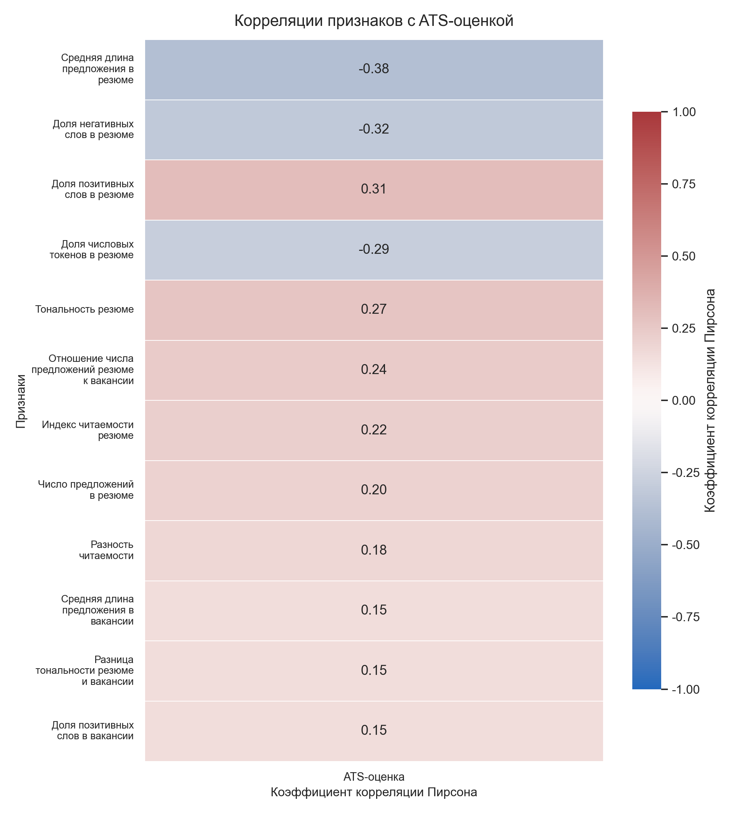

На этом рисунке хорошо видно, что наиболее заметные связи образуют не случайный набор отдельных признаков, а несколько содержательных блоков: структура резюме, тональность текста и согласованность пары «резюме - вакансия». Такая картина возникает потому, что ATS-оценка реагирует не только на наличие ключевых слов, но и на общую читаемость, стиль и степень соответствия текста требованиям вакансии. Именно поэтому сильнее остальных проявляются средняя длина предложения, признаки тональности и меры совпадения документов.

#### График 1а. Полная корреляционная матрица признаков

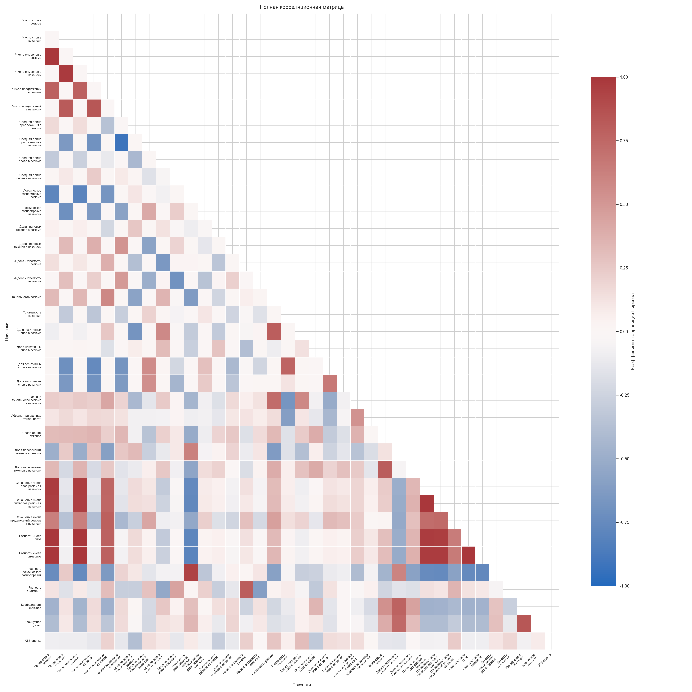

Полная матрица показывает, почему в дальнейшем возникает проблема мультиколлинеарности. Структурные признаки текста естественным образом тянут друг друга: длинные тексты почти всегда содержат и больше слов, и больше символов, и больше предложений. Отношения и разности этих величин наследуют ту же зависимость. Поэтому на матрице появляются плотные блоки высоких корреляций, которые потом отражаются в больших значениях `VIF` (фактора увеличения дисперсии).

#### График 1б. Корреляционная матрица ключевых признаков

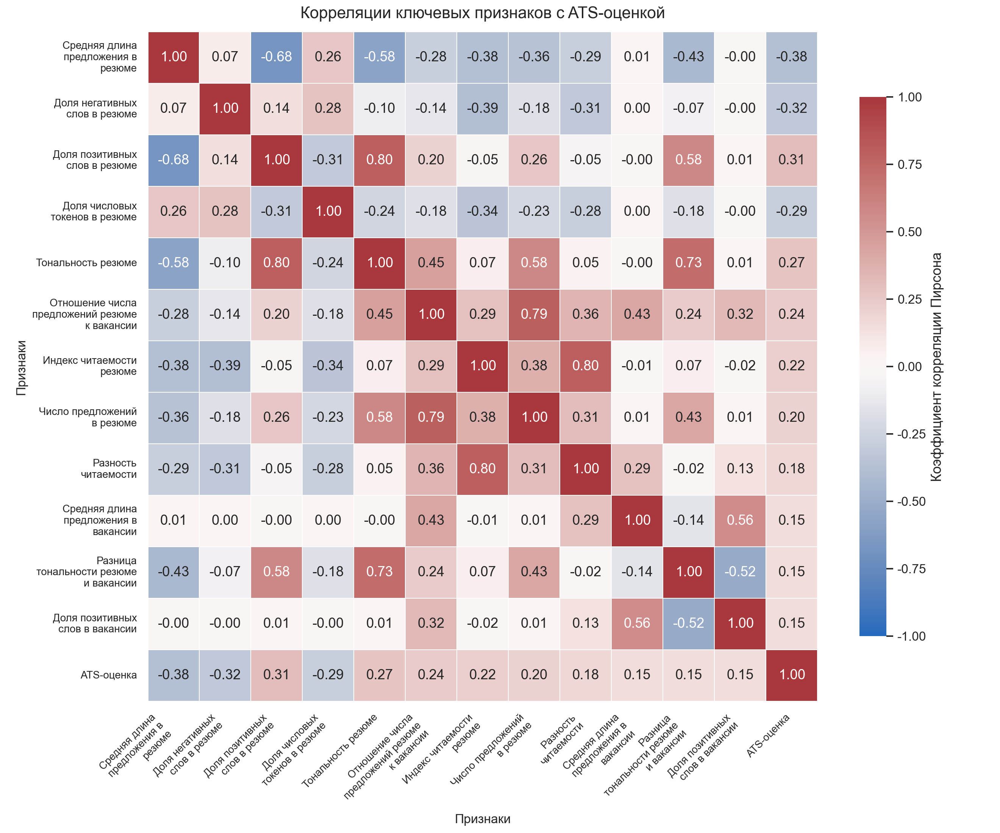

В сокращённой матрице особенно ясно видно, что признаки группируются по смыслу. Это не технический артефакт, а отражение самой природы данных: характеристики длины и читаемости описывают одну сторону текста, тональность — другую, а признаки совпадения — третью. Поэтому внутри групп связи плотнее, чем между группами.

### 8. Проверка статистических гипотез

После корреляционного анализа была выполнена формальная проверка гипотез.

Для признака индекса Жаккара наблюдения были разделены на две группы по порогу `0.1282`. Средняя ATS-оценка в группе высокой схожести составила `39.857`, а в группе низкой схожести — `40.917`. Разница средних оказалась равной `-1.060`. При этом критерий Уэлча дал `p = 7.805e-39`, а критерий Манна–Уитни `p = 1.518e-90`. Следовательно, различие статистически значимо, однако более высокий индекс Жаккара не ведёт автоматически к более высокой ATS-оценке. Иными словами, простое механическое совпадение слов между резюме и вакансией не гарантирует лучшего результата.

Дополнительно был проведён дисперсионный анализ по квартилям косинусного сходства. Для него были получены значения `F = 485.5195` и `p = 1.204e-313`. Здесь `F` — это статистика дисперсионного анализа, то есть отношение межгрупповой вариации к внутригрупповой. Чем она больше, тем сильнее различаются средние значения между квартилями по сравнению со случайным разбросом внутри них. Значение `p` показывает вероятность получить столь сильные различия случайно, если на самом деле средние равны. Поскольку `p` здесь практически равно нулю, нулевая гипотеза отвергается с очень большим запасом. Следовательно, различия между группами с разным уровнем семантического сходства статистически значимы, а смысловая близость резюме и вакансии действительно связана с итоговой оценкой.

Таким образом, статистическая часть подтвердила, что текстовые признаки не являются случайными: они действительно несут информацию, связанную с ATS-оценкой, и поэтому могут быть использованы в регрессионных и ML-моделях.

#### График 1в. Связь индекса Жаккара с ATS-оценкой

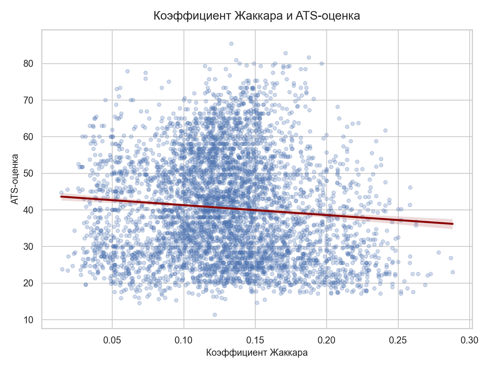

Разброс точек здесь остаётся большим почти на всём диапазоне, и это важно содержательно. Буквальное совпадение слов действительно несёт информацию, но оно слишком грубо описывает соответствие кандидата вакансии. Два текста могут иметь похожий набор терминов, но сильно отличаться по структуре, контексту, конкретике достижений и стилю изложения. Поэтому рост индекса Жаккара не превращается в жёсткий рост ATS-оценки.

#### График 1г. Связь косинусного сходства с ATS-оценкой

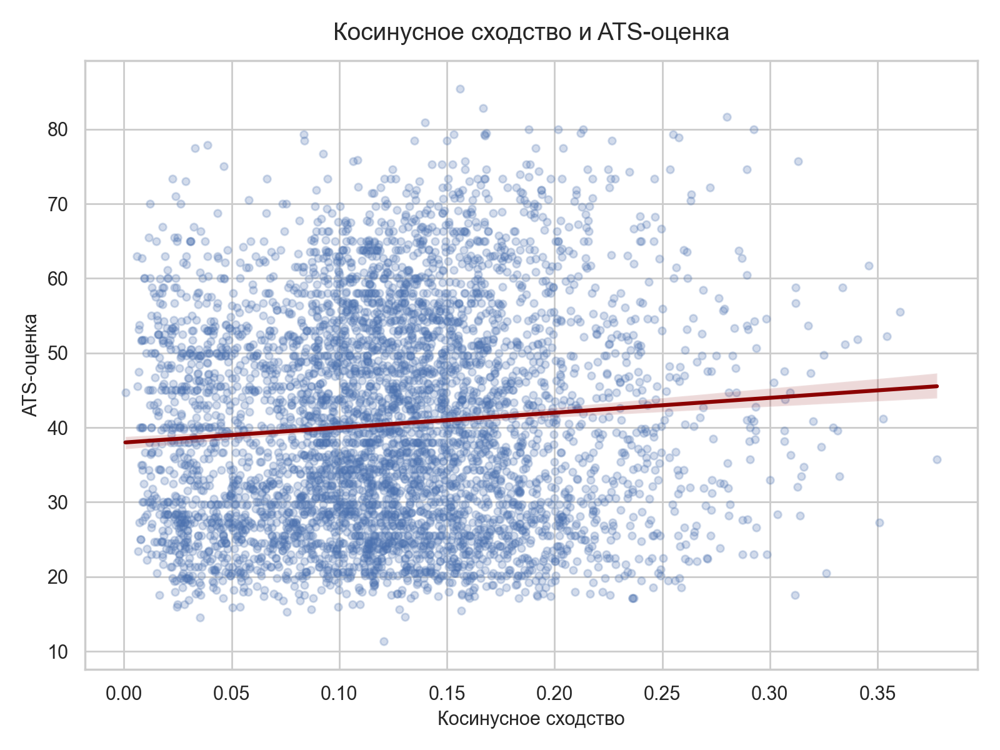

Здесь общий тренд выражен заметно лучше, чем у индекса Жаккара, потому что косинусное сходство учитывает не просто пересечение слов, а их общий профиль в документах. Иными словами, оно лучше ловит тематическую и смысловую близость. Однако даже этот признак не устраняет разброс полностью, потому что итоговая оценка зависит ещё и от структуры резюме, тональности, плотности навыков и других факторов.

### 9. Линейная регрессия и интерпретируемая модель

До построения более сложных алгоритмов была рассмотрена линейная регрессионная постановка задачи. Она важна не только сама по себе, но и как интерпретируемая база для понимания вклада признаков.

В [stat_analysis.py](./stat_analysis.py) для этого были реализованы функции [`fit_ols_with_pvalues`](./stat_analysis.py#L148) и [`evaluate_predictive_models`](./stat_analysis.py#L178). Здесь `OLS` (`Ordinary Least Squares`, обычный метод наименьших квадратов) означает классический способ оценки коэффициентов линейной регрессии. Функция `fit_ols_with_pvalues` оценивает параметры модели этим методом, то есть подбирает такие коэффициенты $\beta_0, \beta_1, \dots, \beta_p$, при которых сумма квадратов остатков

$$
\sum_{i=1}^{n}(y_i - \hat{y}_i)^2
$$

минимальна. После этого для каждого коэффициента рассчитывается его стандартная ошибка, `t-статистика` и `p-value`. Это позволяет проверить нулевую гипотезу вида $H_0: \beta_j = 0$ против альтернативы $H_1: \beta_j \neq 0$. Если `p-value` мало, то соответствующий признак можно считать статистически значимым вкладом в модель при прочих равных условиях. Иначе говоря, такой анализ нужен не только для предсказания, но и для формальной проверки того, какие текстовые характеристики действительно связаны с ATS-оценкой на уровне линейной зависимости.

Функция `evaluate_predictive_models` решает уже следующую методологическую задачу: она сравнивает интерпретируемую линейную модель с `RandomForestRegressor` (случайный лес), который способен учитывать нелинейные зависимости и взаимодействия между признаками. Такое сравнение важно уже на статистическом этапе, поскольку оно показывает, достаточно ли линейной структуры для описания данных или же в данных присутствует более сложная закономерность. Если нелинейная модель заметно превосходит линейную по `R²` и `RMSE`, это служит аргументом в пользу того, что связь между текстовыми признаками и ATS-оценкой не сводится к простой линейной комбинации факторов.

Регрессионная модель имеет вид

$$
Y = \beta_0 + \beta_1 X_1 + \beta_2 X_2 + \dots + \beta_p X_p + \varepsilon,
$$

где $Y$ — ATS-оценка, $X_1, \dots, X_p$ — текстовые признаки, а $\varepsilon$ — случайная ошибка.

По итогам анализа наиболее влиятельными стандартизованными коэффициентами линейной модели оказались:

- число символов в вакансии: `-14.5195`;
- число слов в вакансии: `12.4486`;
- доля пересечения токенов в вакансии: `5.3996`;
- отношение числа слов резюме к вакансии: `5.3610`.

Это показывает, что уже линейная модель улавливает значимую роль длины текста вакансии и степени согласованности резюме с её содержанием. Однако сами значения коэффициентов необходимо интерпретировать с осторожностью из-за присутствующей в данных мультиколлинеарности, о которой будет сказано далее.

### 10. Машинное обучение: постановка эксперимента

После статистической части следующим этапом стало исследование предсказательного потенциала выделенных признаков. Если признаки действительно содержат полезную информацию, то модель машинного обучения должна использовать её для прогноза. В таком случае хорошее качество модели становится дополнительным подтверждением содержательности выделенных текстовых характеристик.

ML-эксперимент реализован в [ml_modeling.py](./ml_modeling.py). В функции [`build_models`](./ml_modeling.py#L80) формируется набор алгоритмов:

- `LinearRegression`;
- `Ridge`;
- `RandomForestRegressor`;
- `GradientBoostingRegressor`.

Выбор моделей был сделан так, чтобы сравнить несколько различных классов зависимостей. `LinearRegression` выступала как базовая линейная модель без регуляризации. `Ridge` (гребневая регрессия) использовалась как линейная модель с `L2`-регуляризацией, то есть с добавочным штрафом к функционалу потерь:

$$
\min_{\beta}\left(\sum_{i=1}^{n}(y_i - \hat{y}_i)^2 + \alpha \sum_{j=1}^{p}\beta_j^2\right).
$$

В этой формуле первая сумма

$$
\sum_{i=1}^{n}(y_i - \hat{y}_i)^2
$$

представляет собой обычную сумму квадратов ошибок прогноза: чем хуже модель приближает реальные значения, тем больше становится эта часть функционала. Вторая часть

$$
\alpha \sum_{j=1}^{p}\beta_j^2
$$

является штрафом за слишком большие коэффициенты модели. Параметр $\alpha$ управляет силой этого штрафа: при увеличении $\alpha$ модель сильнее “сжимает” коэффициенты к нулю, делая решение более устойчивым, но потенциально менее гибким.

Такой штраф особенно полезен в условиях коррелированных признаков. Когда несколько переменных несут близкую информацию, обычная линейная регрессия может распределять веса между ними неустойчиво, из-за чего коэффициенты становятся чрезмерно большими по модулю и чувствительными к небольшим изменениям данных. `Ridge` сглаживает эту проблему, поскольку предпочитает решения с более умеренными коэффициентами. Именно поэтому для `Ridge` предварительно использовалась стандартизация признаков: без приведения к сопоставимому масштабу регуляризация действовала бы на разные признаки неравномерно. Значение `alpha = 1.0` задаёт умеренную силу регуляризации и выступает как компромисс между устойчивостью модели и сохранением её гибкости.

Для `RandomForestRegressor` (случайный лес) использовались параметры `n_estimators = 300`, `min_samples_leaf = 3`, `random_state = 42`. Число деревьев `n_estimators` определяет размер ансамбля: чем больше деревьев, тем устойчивее итоговый прогноз и тем ниже дисперсия модели, хотя вычислительная стоимость возрастает. Параметр `min_samples_leaf = 3` ограничивает чрезмерное дробление дерева и снижает риск переобучения на локальных выбросах. Фиксированный `random_state` нужен для воспроизводимости результатов.

Для `GradientBoostingRegressor` (градиентный бустинг) использовались параметры `n_estimators = 250`, `learning_rate = 0.05`, `max_depth = 3`. В бустинге итоговая модель строится как сумма последовательных слабых моделей, каждая из которых исправляет ошибки предыдущих. Параметр `learning_rate` регулирует вклад каждого нового дерева: меньшее значение делает обучение более осторожным и часто улучшает обобщающую способность, но требует большего числа итераций. Ограничение `max_depth = 3` оставляет базовые деревья сравнительно простыми, чтобы модель концентрировалась на постепенном уточнении зависимости, а не на запоминании обучающей выборки.

Кросс-валидация реализована в функции [`run_cross_validation`](./ml_modeling.py#L109) и выполнялась по схеме `KFold` с перемешиванием и фиксированным `random_state`. В этой схеме выборка разбивается на `K` частей, после чего модель `K` раз обучается на `K-1` частях и проверяется на оставшейся части. Затем результаты усредняются. Такой подход позволяет уменьшить зависимость оценки качества от случайного разбиения данных и получить более надёжное представление о том, насколько хорошо модель будет работать на новых наблюдениях.

Для каждой модели вычислялись среднее и стандартное отклонение `R²`, а также среднее и стандартное отклонение `RMSE`. Среднее значение метрики отражает ожидаемое качество модели, тогда как стандартное отклонение показывает устойчивость результата при разных разбиениях выборки. Если среднее качество высоко, но разброс велик, это означает, что модель может быть нестабильной; если же разброс мал, то поведение модели можно считать более надёжным.

После этапа кросс-валидации лучшая модель обучалась на тренировочной части данных и дополнительно проверялась на отдельной отложенной выборке в функции [`fit_best_model`](./ml_modeling.py#L139). Такой финальный тест принципиально важен: кросс-валидация помогает выбрать наиболее удачный алгоритм и его конфигурацию, а проверка на отложенной выборке имитирует ситуацию применения модели к полностью новым данным, которые не участвовали ни в обучении, ни в промежуточной оценке качества. Благодаря этому итоговые значения `R²`, `RMSE` и `MAE` можно интерпретировать как наиболее честную оценку практической пригодности модели.

### 11. Результаты ML-моделирования

Лучшей по результатам кросс-валидации оказалась модель `RandomForestRegressor` (случайный лес), показавшая:

- `CV R² = 0.5685 ± 0.0037`;
- `CV RMSE = 9.2992 ± 0.0428`.

На отложенной выборке её качество составило:

- `R² = 0.5752`;
- `RMSE = 9.2859`;
- `MAE = 7.6104`.

Этот результат означает, что модель объясняет более половины изменчивости ATS-оценки. Для текстовой задачи такого типа это сильный результат, особенно с учётом того, что модель использует не глубокие языковые эмбеддинги, а интерпретируемые инженерные признаки.

Важно пояснить, почему в проекте использовались именно классические модели машинного обучения, а не глубокие NLP-модели, например трансформеры семейства `BERT`. Целью работы было не только получить точный прогноз, но и провести **статистический анализ связи** между характеристиками текста и ATS-оценкой. Для этого принципиально важна интерпретируемость признаков: нужно понимать, как на результат влияют длина предложений, тональность, совпадение терминов, читаемость и конкретные словосочетания.

Глубокие NLP-модели могли бы потенциально повысить точность, но сделали бы выводы гораздо менее прозрачными. Напротив, классические модели на инженерных признаках позволяют связать статистическую и ML-часть проекта в единую логику: одни и те же признаки участвуют и в корреляционном анализе, и в проверке гипотез, и в регрессии, и в модели `RandomForestRegressor` (случайный лес). Поэтому такой выбор здесь является не упрощением, а осознанным компромиссом между качеством прогноза и объяснимостью результата.

#### График 2. Фактическая и предсказанная ATS-оценка

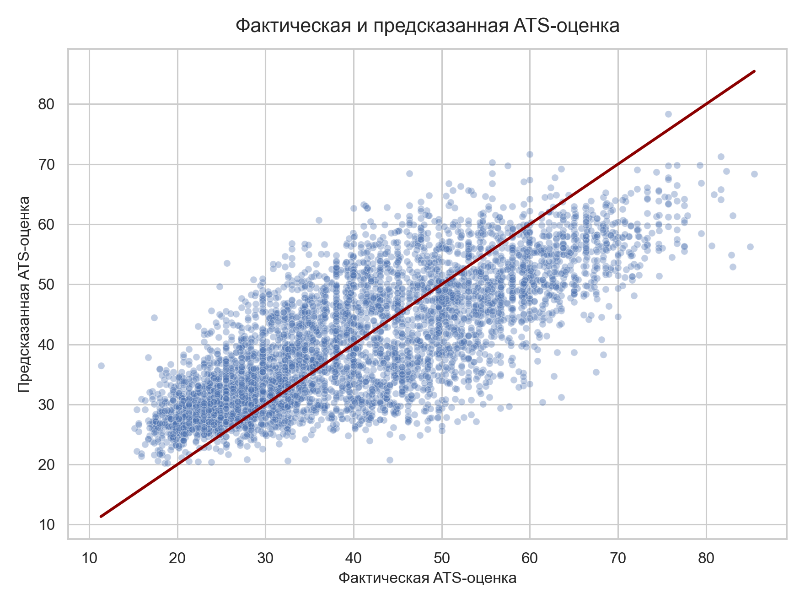

Точки не расползаются хаотично по всему полю, а тяготеют к диагонали, значит модель действительно улавливает закономерность, а не выдаёт усреднённый ответ. При этом на краях диапазона разброс больше. Такая картина типична для регрессионных задач: экстремально низкие и экстремально высокие значения встречаются реже, а значит модель получает меньше примеров для их устойчивого изучения.

#### График 3. Остатки модели

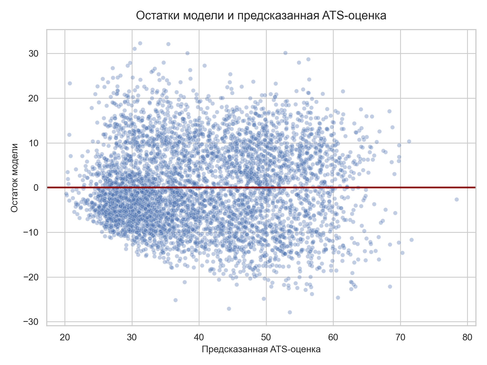

Остатки в основном распределены вокруг нуля без явной криволинейной структуры, а значит модель не демонстрирует сильного систематического смещения. Если бы здесь возникала дуга, конус или выраженный наклон, это означало бы, что в данных осталась неучтённая закономерность. Умеренное расширение облака в правой части согласуется с тем, что высокие оценки предсказывать труднее.

#### График 3а. Распределение остатков модели

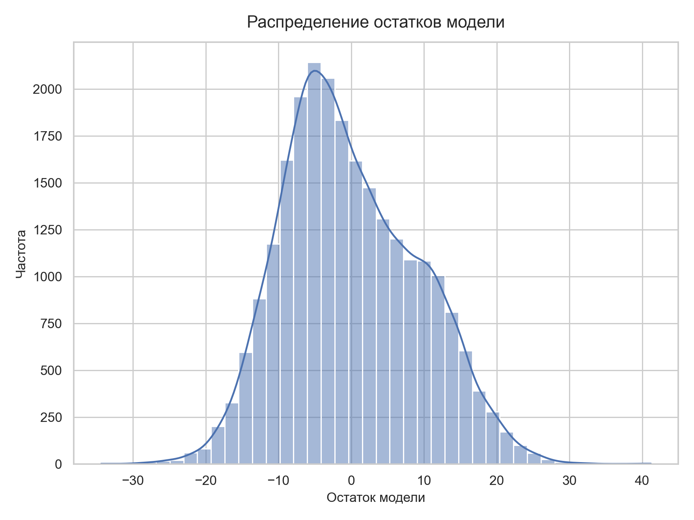

Пик распределения около нуля означает, что большая часть прогнозов ошибается умеренно, а не за счёт редких очень удачных попаданий. Если бы распределение было сильно смещено в сторону крупных остатков, хорошее среднее качество оказалось бы менее надёжным. Здесь же видно, что основной вклад дают небольшие и средние ошибки, а крупные промахи встречаются заметно реже.

#### График 4. Важность признаков

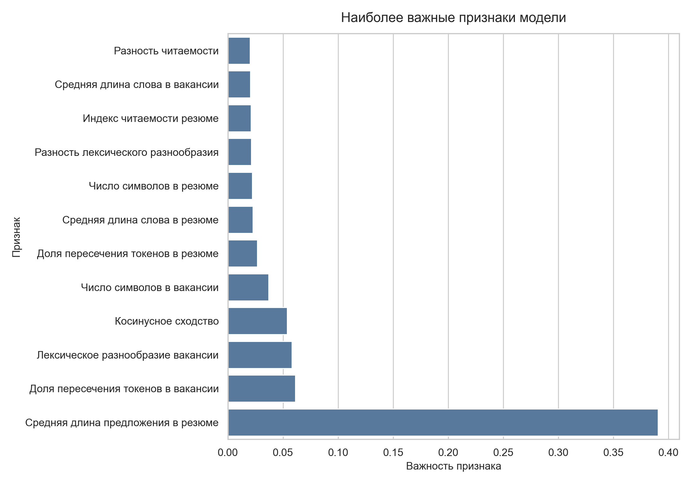

Картина важностей не сводится к одному типу признаков, и это как раз главный вывод. Вверху одновременно оказываются признаки структуры резюме, лексические характеристики и меры согласованности с вакансией. Значит модель не опирается на один простой эвристический сигнал, а собирает итоговую оценку из нескольких разных сторон текста.

### 12. Анализ тональности

Следующим этапом стал анализ тональности текста, реализованный в функции [`analyze_sentiment`](./phrase_and_sentiment_analysis.py#L118) файла [phrase_and_sentiment_analysis.py](./phrase_and_sentiment_analysis.py). Здесь проверялось, влияет ли эмоциональная окраска текста резюме и вакансии на итоговую ATS-оценку.

Основные результаты таковы: доля негативных слов в резюме дала `r = -0.3168`, доля позитивных слов в резюме — `r = 0.3105`, общая тональность резюме — `r = 0.2689`, а разница тональности резюме и вакансии — `r = 0.1518`. Следовательно, влияние оказывает не только наличие релевантных навыков, но и то, в каком тоне подан текст.

#### График 5. Связь признаков тональности с ATS-оценкой

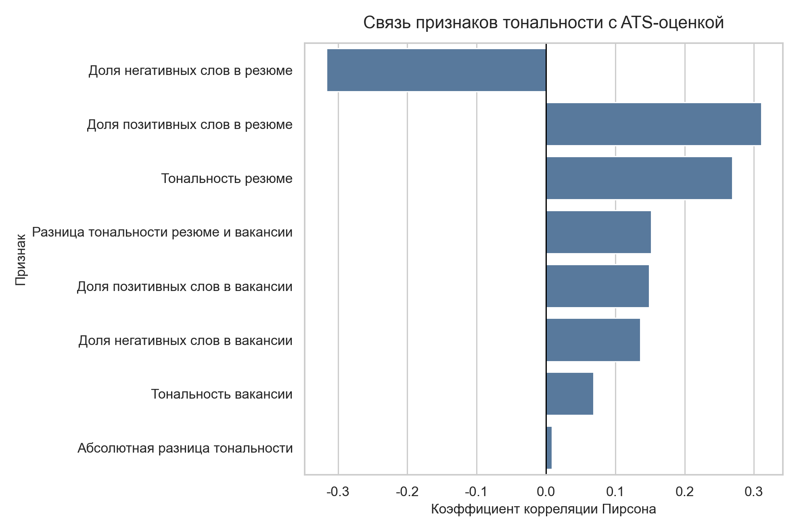

Здесь особенно важно не только наличие связи, но и её асимметрия. Негативная лексика ухудшает результат сильнее, чем сопоставимое по масштабу повышение даёт нейтрально-позитивная подача. Это естественно для резюме: избыточно негативные или проблемные формулировки воспринимаются системой как сигнал слабого соответствия, тогда как позитивная тональность работает скорее как дополнительное усиление хорошо структурированного текста.

#### График 5а. Тональность резюме и ATS-оценка

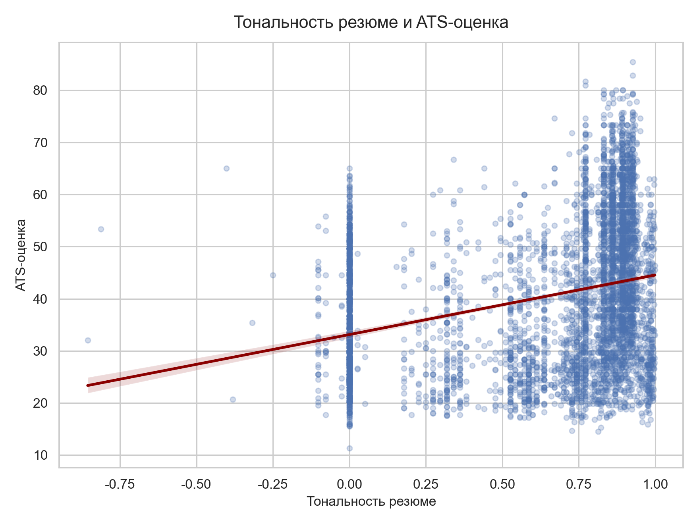

Плотный столбец около нуля означает, что значительная часть резюме написана в нейтральном деловом стиле: слов тональности либо мало, либо положительные и отрицательные сигналы взаимно компенсируются. Остальные вертикальные полосы возникают из-за словарного способа расчёта, при котором разные тексты нередко получают одинаковые значения. Несмотря на эту дискретность, заметно, что в положительной области верхняя граница ATS-оценок выше, а низкие значения встречаются реже. Это поддерживает вывод о том, что уверенная и позитивная подача текста связана с более высокой оценкой.

#### График 5б. Тональность вакансии и ATS-оценка

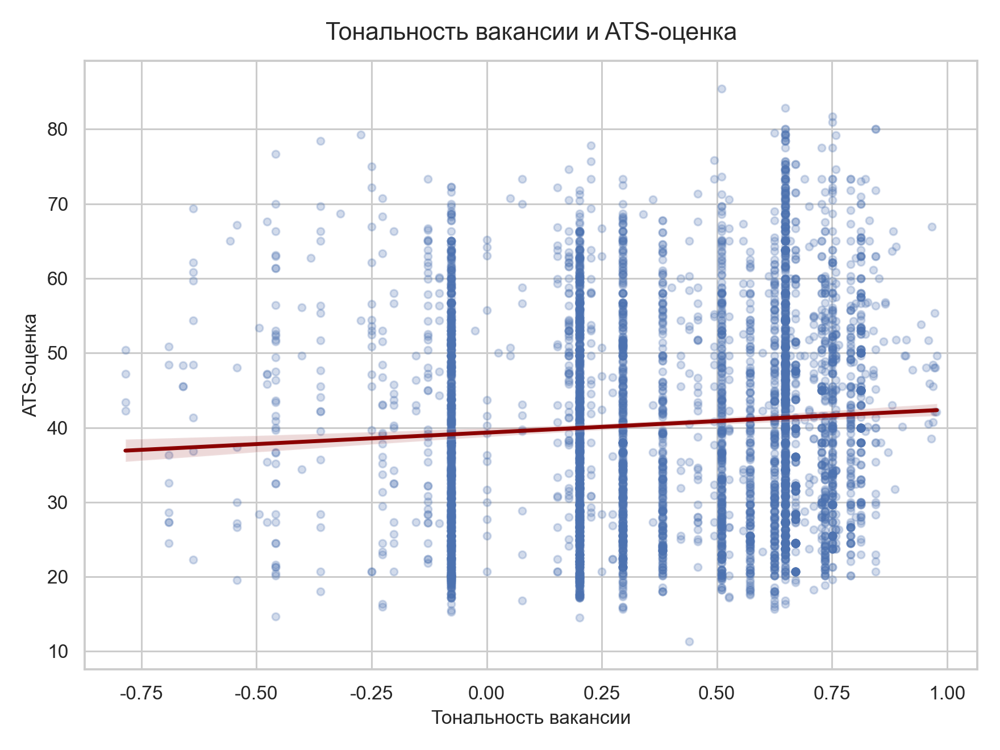

Здесь картина похожа по форме, но слабее по смыслу: вертикальные полосы снова связаны с шаблонностью текстов и словарной оценкой, а скопление около нуля отражает нейтральный стиль многих вакансий. Главное отличие в том, что зависимость с итоговой оценкой выражена заметно слабее, чем у резюме. Это означает, что итоговая оценка больше зависит от того, как кандидат описывает себя, чем от эмоциональной окраски самой вакансии.

#### График 5в. Разница тональности и ATS-оценка

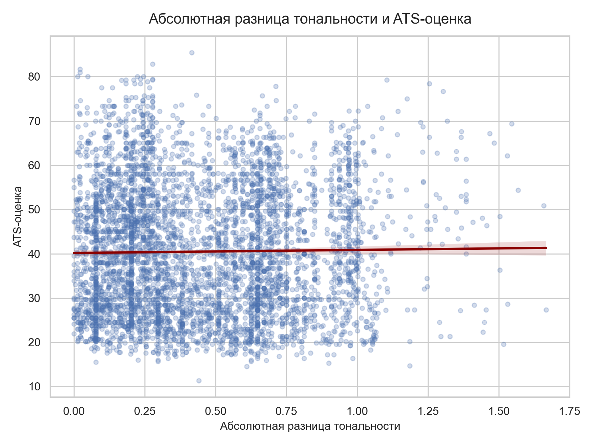

Концентрация значений около нуля показывает, что у многих пар резюме и вакансии эмоциональный тон близок. Эффект здесь есть, но он слабее, чем у собственной тональности резюме. Следовательно, стилистическое совпадение играет вспомогательную роль: оно может поддерживать высокий результат, но решающим остаётся тон и качество самого резюме.

### 13. Анализ словосочетаний

После анализа тональности был выполнен анализ устойчивых сочетаний слов, то есть `n-грамм`. Он реализован в функциях [`analyze_ngram_frame`](./phrase_and_sentiment_analysis.py#L164) и [`plot_group_ngram_results`](./phrase_and_sentiment_analysis.py#L312) файла [phrase_and_sentiment_analysis.py](./phrase_and_sentiment_analysis.py).

Среди формулировок, чаще связанных с высокой ATS-оценкой, выделились `aws certified` (сертифицирован по AWS), `certified scrum master` (сертифицированный Scrum-мастер), `best performer` (лучший сотрудник по результатам) и `innovation excellence award` (награда за инновационные достижения). Среди формулировок, чаще связанных с низкой ATS-оценкой, заметно чаще встречались `exposure includes` (имеется опыт в отдельных областях), `professional years` (число лет профессионального опыта), `bachelor degree` (степень бакалавра) и `problem solving` (решение проблем).

#### График 6. Полезные словосочетания в резюме

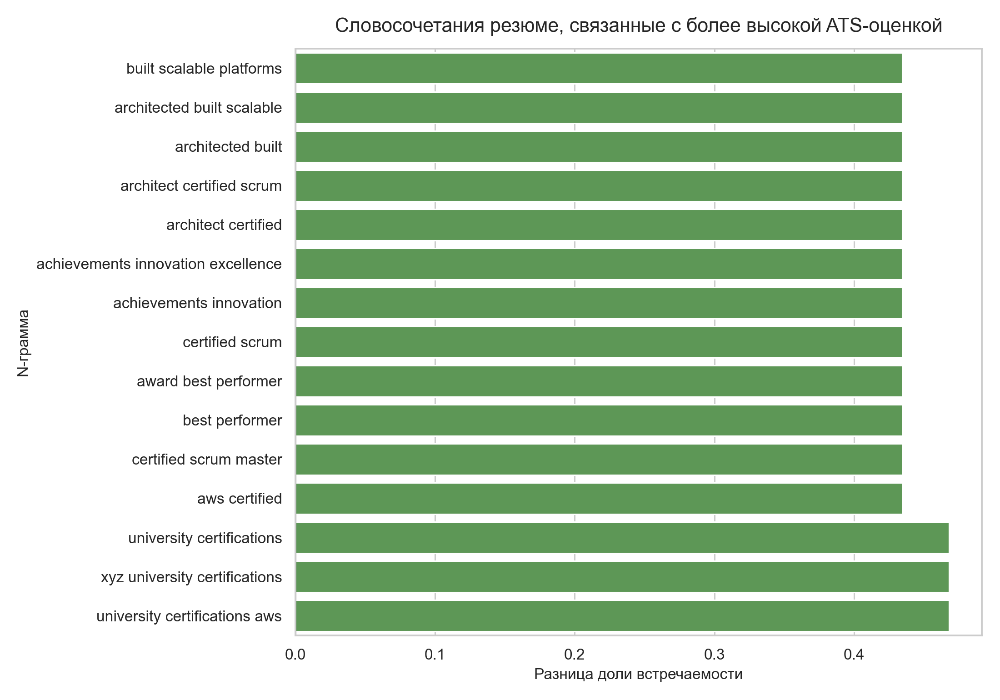

В верхней части этого списка оказываются не случайные красивые слова, а формулировки, связанные с конкретными достижениями, сертификацией и подтверждённым результатом. Именно поэтому они тяготеют к более высоким оценкам: такие выражения дают системе более явные сигналы квалификации, чем общие декларации без проверяемого содержания.

#### График 6а. Словосочетания резюме, связанные с более низкой ATS-оценкой

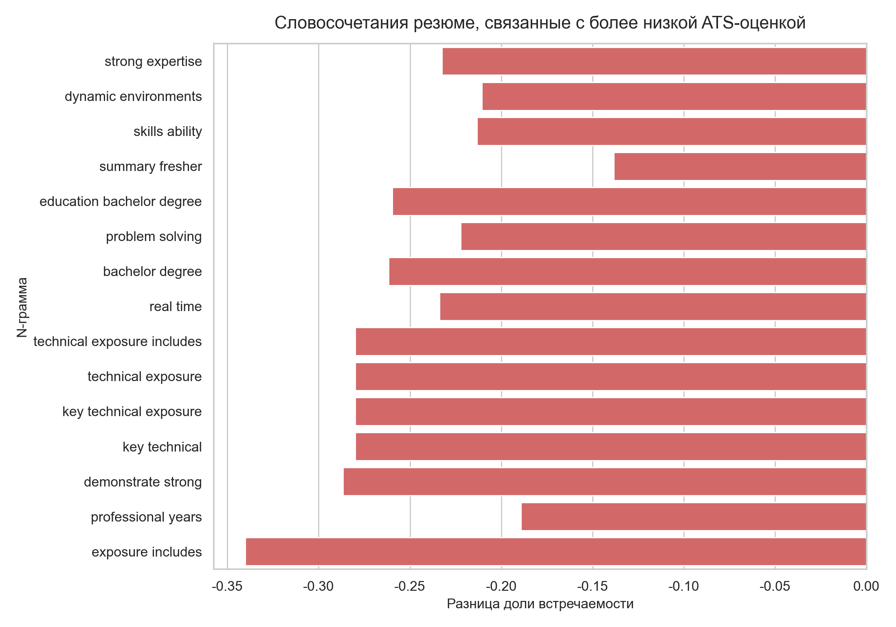

Здесь, наоборот, преобладают более общие и расплывчатые конструкции. Такая картина возникает потому, что они хуже передают конкретные навыки и достижения, а значит дают системе меньше информации о реальном соответствии вакансии. Поэтому подобные формулировки чаще встречаются в резюме с пониженной оценкой.

#### График 6б. Словосочетания вакансий, связанные с более высокой ATS-оценкой

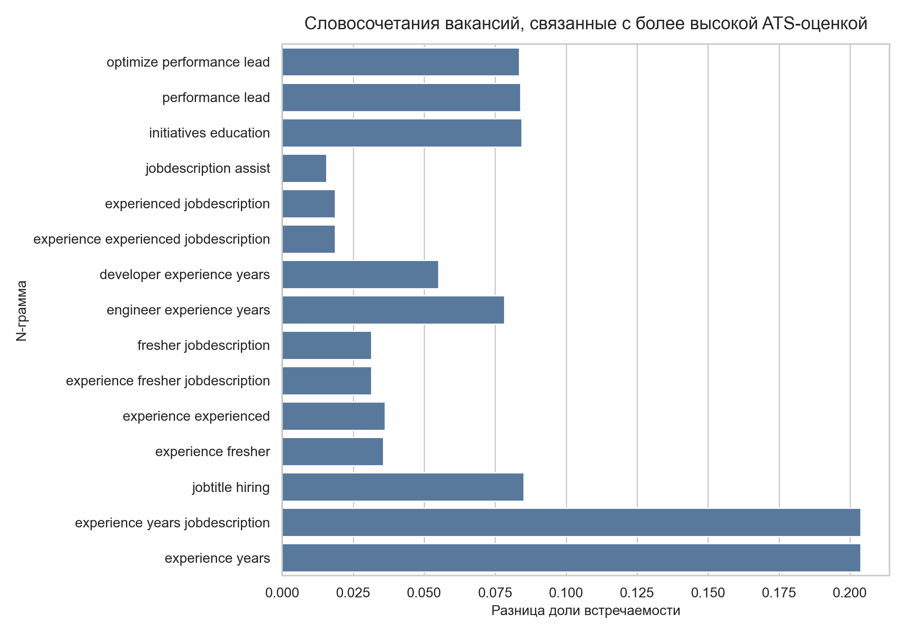

Положительные `n-граммы` вакансий отражают те контексты, в которых система чаще находит у кандидатов сильное содержательное совпадение. Обычно это более конкретные и профессионально определённые требования. Когда вакансия описана ясно и предметно, резюме легче сопоставить с ней по содержанию, поэтому итоговая оценка чаще оказывается выше.

#### График 6в. Словосочетания вакансий, связанные с более низкой ATS-оценкой

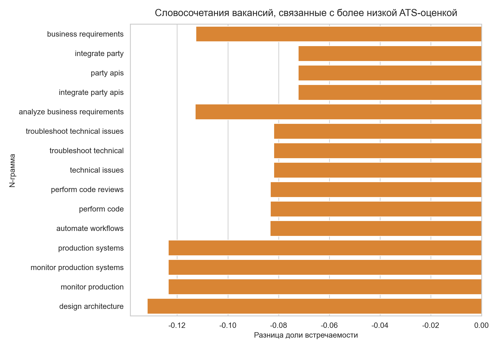

Негативные `n-граммы` вакансий чаще соответствуют менее определённым или менее содержательно насыщенным описаниям. В таком контексте системе сложнее обнаружить явное совпадение между требованиями и опытом кандидата, поэтому диапазон высоких оценок сужается.

#### График 7. Словосочетания по группам вакансий

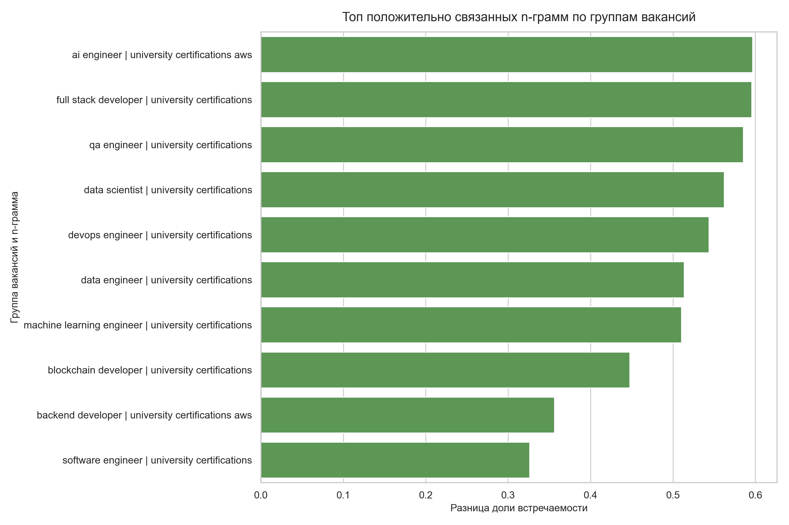

Здесь особенно хорошо видно, почему универсальный шаблон резюме работает ограниченно. Разные профессиональные группы ожидают разные сигналы компетентности: в одних случаях важны инструменты и технологии, в других — процессы, сертификация или управленческий опыт. Поэтому сильные формулировки оказываются зависящими от типа вакансии.

#### График 7а. Негативные словосочетания по группам вакансий

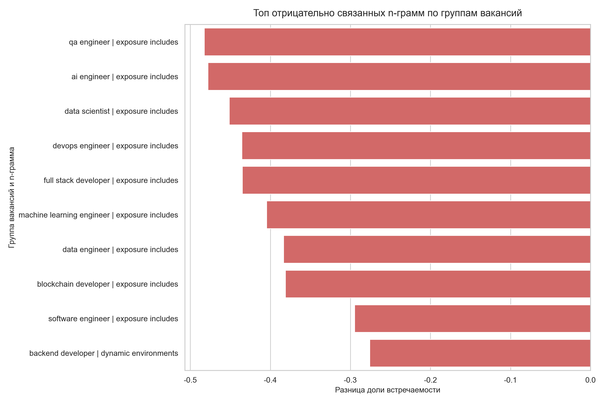

Отрицательная картина по группам вакансий тоже различается, и это закономерно. Формулировка, которая выглядит слабой для одной роли, может быть нейтральной для другой. Значит, неудачные выражения так же зависят от профессионального контекста, как и удачные.

### 14. Абляционный анализ

После этого был выполнен абляционный анализ, реализованный в [ablation_study.py](./ablation_study.py), прежде всего в функциях [`save_plots`](./ablation_study.py#L181) и [`write_summary`](./ablation_study.py#L205). Его задача состояла в том, чтобы определить, какие группы признаков действительно дают вклад в качество модели.

Результаты оказались показательными. Для `Ridge` (гребневая регрессия) базовое качество составило `CV R² = 0.4038`, а качество на отложенной выборке — `R² = 0.4114`; сильнее всего качество ухудшалось при удалении признаков тональности, где падение достигало `ΔR² = 0.0308`. Для `RandomForestRegressor` (случайный лес) базовое качество было равно `CV R² = 0.5644`, а качество на отложенной выборке — `R² = 0.5752`; в этом случае сильнее всего качество ухудшалось при удалении лексических признаков, где падение составило `ΔR² = 0.0119`.

#### График 8. Абляционный анализ признаков

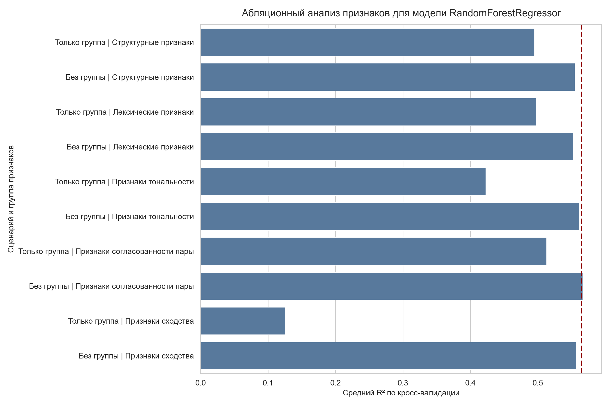

Здесь важно не абсолютное значение каждого столбца, а то, как сильно проседает качество при исключении группы признаков. У `RandomForestRegressor` падение оказывается сравнительно умеренным, потому что нелинейная модель умеет частично компенсировать потерю одной группы за счёт других взаимосвязанных признаков. Это показывает, что лес использует признаки более гибко и распределённо.

#### График 8а. Абляционный анализ для Ridge (гребневая регрессия)

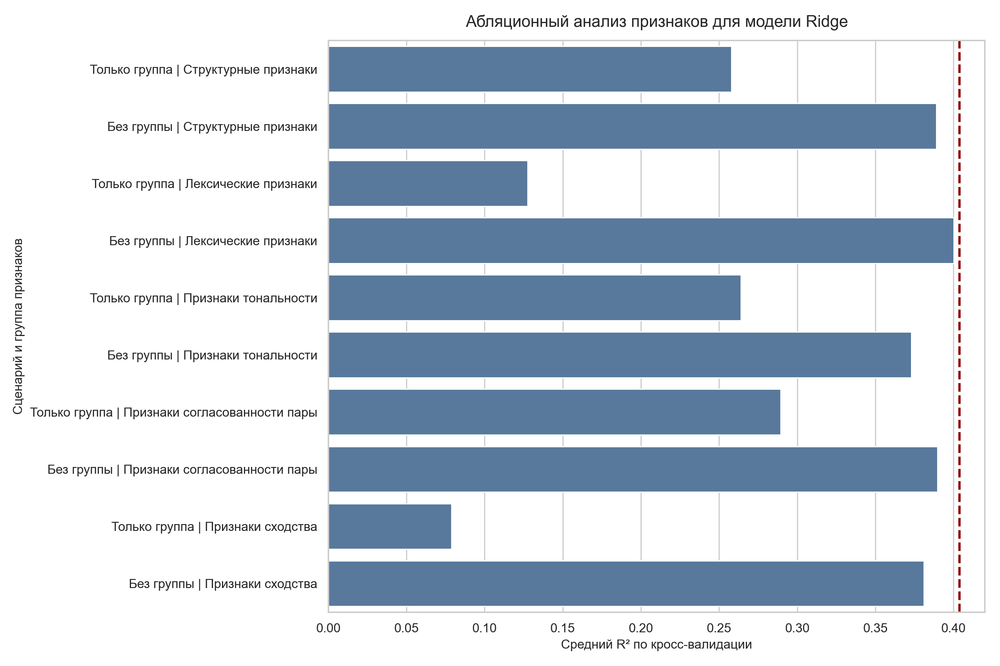

Для `Ridge` картина обычно жёстче: исключение сильной группы признаков даёт более заметную просадку. Причина в том, что линейная модель не умеет восстанавливать сложные взаимодействия между переменными так же гибко, как ансамбль деревьев. Поэтому для неё качество инженерных признаков критично сильнее.

### 15. Проверка мультиколлинеарности

Следующим этапом стал анализ мультиколлинеарности, реализованный в [multicollinearity_analysis.py](./multicollinearity_analysis.py), прежде всего в функциях [`compute_vif`](./multicollinearity_analysis.py#L32) и [`save_plots`](./multicollinearity_analysis.py#L77). Его задача состояла в том, чтобы проверить, не дублируют ли признаки друг друга слишком сильно.

Были обнаружены очень сильные корреляции. Например, число слов в резюме и разность числа слов дали `r = 0.9986`, число символов в резюме и разность числа символов — `r = 0.9974`, а число слов в резюме и число символов в резюме — `r = 0.9973`. Это означает, что часть признаков несёт очень близкую информацию.

#### График 9. Тепловая карта мультиколлинеарности

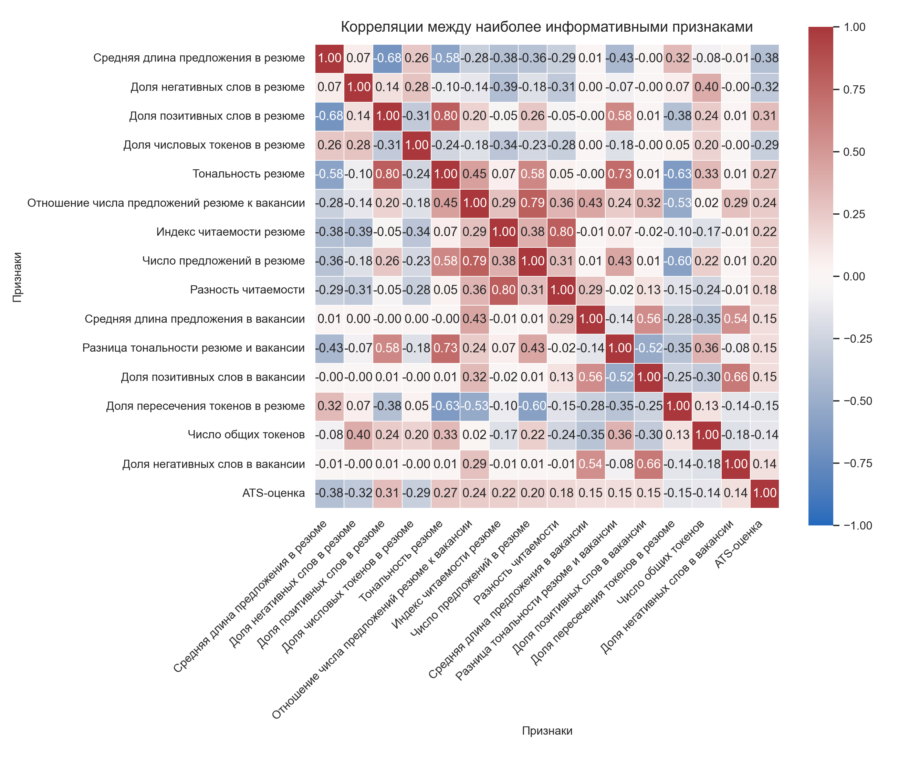

Плотные яркие блоки на этой карте появляются потому, что многие признаки были сконструированы из одних и тех же базовых характеристик текста. Если длина текста уже зафиксирована в словах и символах, то отношения, разности и связанные показатели неизбежно наследуют эту структуру. Поэтому карта показывает не случайные совпадения, а закономерную избыточность части инженерных признаков.

#### График 10. Значения VIF

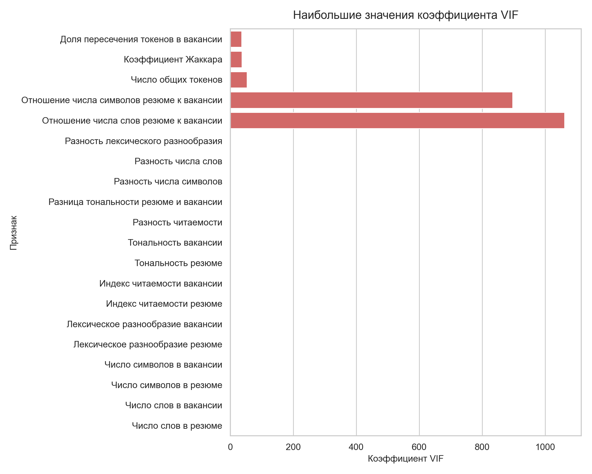

`VIF` (`Variance Inflation Factor`, фактор увеличения дисперсии) означает, насколько возрастает неопределённость оценки коэффициента из-за связи признака с другими признаками. Для каждого признака он вычисляется по формуле

$$
VIF_j = \frac{1}{1 - R_j^2},
$$

где $R_j^2$ — коэффициент детерминации при регрессии $j$-го признака на все остальные признаки. Смысл этого показателя следующий: если некоторый признак хорошо восстанавливается через другие признаки, его собственный коэффициент в линейной модели становится нестабильным, а его стандартная ошибка возрастает. Именно это и называется мультиколлинеарностью.

На графике признаки ранжированы по значению `VIF`. Чем выше столбец, тем сильнее данный признак линейно объясняется другими признаками. Высокие значения у признаков вроде **отношения числа слов резюме к вакансии**, **отношения числа символов** или соответствующих разностей возникают не случайно. Эти признаки почти алгебраически связаны с базовыми длиновыми признаками, например с числом слов и числом символов в резюме и вакансии. Если в модели уже есть сами длины текстов, то их отношения и разности часто оказываются почти восстанавливаемыми комбинациями этих же переменных. Поэтому `VIF` у них становится очень большим.

Аналогичная логика действует и для базовых длиновых метрик. Например, число слов и число символов в одном и том же тексте обычно очень тесно связаны друг с другом: длинный текст почти всегда одновременно содержит и больше слов, и больше символов. Из-за этого группа длиновых признаков образует плотный кластер, внутри которого многие переменные несут почти одну и ту же информацию.

Если для части признаков столбцы выглядят почти незаметными, это не означает нулевой `VIF`: минимально он равен `1`. Визуально “нулевые” столбцы лишь показывают, что такие признаки слабо объясняются остальными по сравнению с лидерами графика. Обычно это более самостоятельные характеристики текста, например отдельные аспекты тональности, лексического разнообразия или специфические меры сходства, которые нельзя почти линейно восстановить из одной только длины текста.

Таким образом, `VIF` здесь выступает как практический инструмент интерпретации линейной модели: он показывает, какие признаки можно оставить без опасений, а какие разумно рассматривать как кандидаты на сокращение или укрупнение ради более устойчивой и понятной регрессии.

### 16. Анализ ошибок модели

После этого был отдельно выполнен анализ ошибок лучшей модели. Данный этап реализован в [model_error_analysis.py](./model_error_analysis.py), прежде всего в функциях [`error_by_group`](./model_error_analysis.py#L102) и [`save_plots`](./model_error_analysis.py#L160).

Результаты по квартилям фактической ATS-оценки показали, что для `Q1` (нижний квартиль, то есть группа с самыми низкими оценками) ошибка `MAE` равна `6.8847`, для `Q2` — `6.2449`, для `Q3` — `7.6179`, а для `Q4` (верхний квартиль, то есть группа с самыми высокими оценками) уже `9.6914`. Следовательно, модель заметно хуже справляется с наблюдениями, у которых ATS-оценка особенно высока. Если рассматривать группы вакансий, то наиболее сложными оказались `ai researcher` (исследователь в области искусственного интеллекта) с `MAE = 8.8468`, `mobile developer` (мобильный разработчик) с `MAE = 8.7886` и `qa lead` (руководитель направления тестирования) с `MAE = 8.3844`.

#### График 11. Абсолютная ошибка и предсказанная оценка

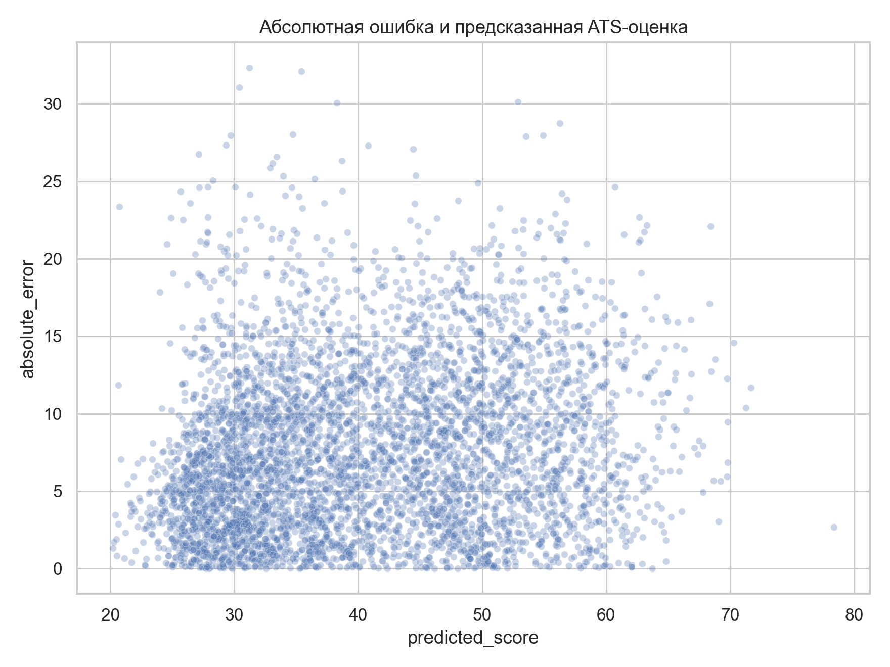

Ошибка увеличивается на высоких значениях не случайно: сильные кандидаты и очень высокие ATS-оценки обычно описываются более разнообразно, а таких наблюдений в данных меньше. Из-за этого модель хуже обобщает именно верхнюю часть шкалы и чаще допускает там более крупные отклонения.

#### График 11а. Распределение абсолютной ошибки

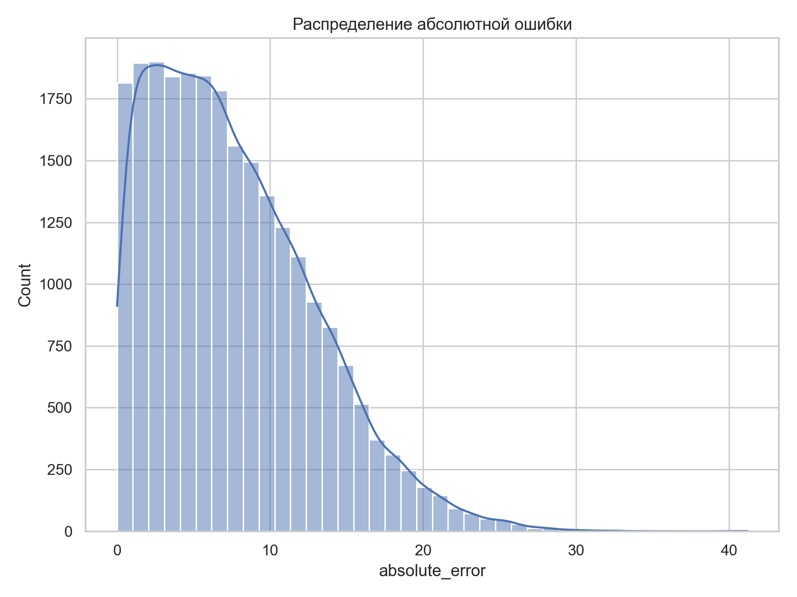

Скошенность распределения в сторону малых и средних ошибок означает, что типичный прогноз модели приемлем по точности, а большие промахи составляют меньшую долю. Это более сильный результат, чем просто хорошее среднее значение `MAE`, потому что он показывает характер ошибок, а не только их агрегированную величину.

#### График 11б. Ошибка по квартилям косинусного сходства

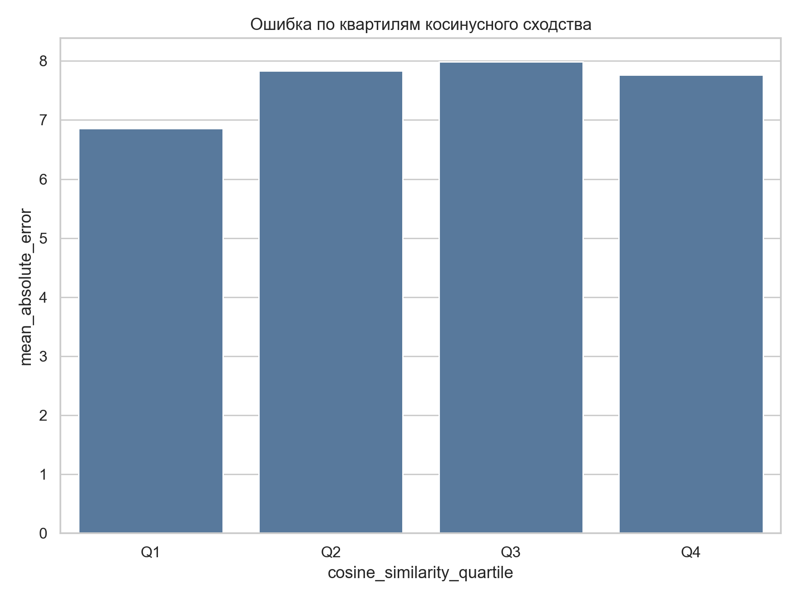

Если ошибка меняется по квартилям косинусного сходства, это означает, что модель по-разному чувствует себя в более очевидных и более неоднозначных парах «резюме - вакансия». Там, где смысловое совпадение выражено чётко, структура сигнала для модели обычно проще. Там, где совпадение промежуточное или размытое, прогнозировать труднее.

#### График 11в. Ошибка по квартилям средней длины предложения

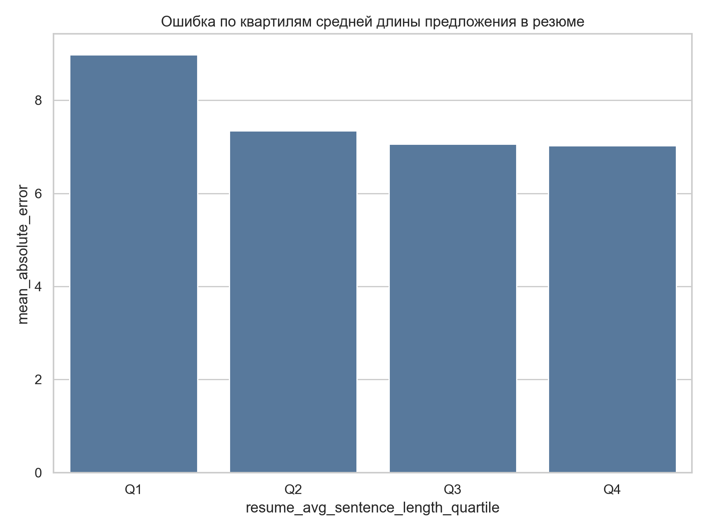

Если ошибка возрастает вместе со средней длиной предложения, это хорошо согласуется с общей статистической картиной проекта. Более длинные и сложные предложения затрудняют и саму оценку резюме, и её предсказание моделью, потому что в таких текстах сложнее выделять явные и однозначные сигналы соответствия вакансии.

#### График 12. Самые сложные группы вакансий

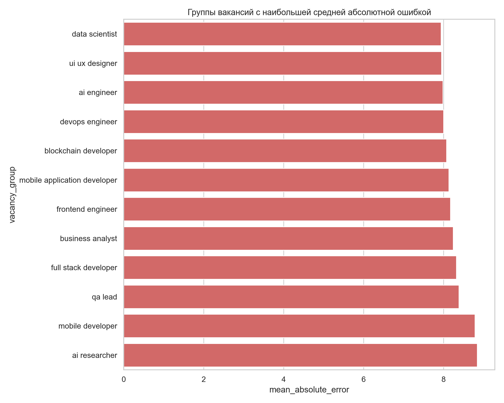

Разные группы вакансий дают разную ошибку не потому, что модель работает нестабильно случайно, а потому что сами профессиональные домены различаются по языку, структуре требований и способу описания опыта. Там, где роль требует более специфических терминов или нестандартного опыта, текущего набора признаков оказывается недостаточно. Поэтому этот график показывает, где развитие признаков даст наибольшую практическую отдачу.

### 17. Практические выводы

Итоговые рекомендации формируются в [practical_recommendations.py](./practical_recommendations.py), точка входа — [`main`](./practical_recommendations.py#L126).

Основные практические выводы проекта можно сформулировать уже не только как общие рекомендации, но и как следствия из проведённого анализа. Во-первых, резюме действительно желательно делать более структурированным и не перегружать чрезмерно длинными предложениями. Отрицательная связь средней длины предложения с ATS-оценкой и рост ошибки модели на более сложных текстах показывают, что слишком тяжёлый синтаксис ухудшает как восприятие резюме, так и его формальное соответствие критериям автоматической оценки.

Во-вторых, важен не сам по себе набор ключевых слов, а содержательное совпадение резюме с вакансией. Результаты по индексу Жаккара и косинусному сходству показывают, что простое буквальное повторение терминов не гарантирует высокой оценки. Намного важнее, чтобы опыт, навыки и используемые формулировки действительно отражали требования вакансии на смысловом уровне. Иными словами, резюме должно быть не просто “похоже по словам”, а релевантно по содержанию.

В-третьих, статистически более сильными выглядят формулировки, в которых присутствуют конкретные достижения, сертификация, награды и подтверждённые результаты. Анализ словосочетаний показал, что выражения, связанные с сертификатами и измеримыми достижениями, чаще встречаются в резюме с более высокой ATS-оценкой, тогда как общие и расплывчатые конструкции оказываются характернее для более слабых профилей. Это означает, что при составлении резюме предпочтительнее писать не “участвовал в разных задачах”, а указывать, что именно было сделано, в каком контексте и с каким результатом.

В-четвёртых, роль играет и тональность текста. Позитивная, уверенная и профессионально нейтральная подача в среднем связана с более высокой оценкой, тогда как избыточно негативные или проблемно окрашенные формулировки связаны с её снижением. При этом речь не идёт о чрезмерно рекламном стиле: практический вывод состоит скорее в том, что резюме должно быть написано уверенно, конкретно и без негативной риторики.

Наконец, важен учёт профессионального контекста. Анализ по группам вакансий показал, что удачные и неудачные формулировки различаются в зависимости от типа позиции. Следовательно, универсальное резюме “на все вакансии” работает ограниченно. С практической точки зрения это означает, что наиболее эффективной стратегией является адаптация резюме под конкретное направление: для каждой роли нужно по-разному расставлять акценты, подбирать словарь навыков и по-разному описывать опыт.

Таким образом, итоговая прикладная рекомендация состоит в следующем: сильное резюме для ATS-системы — это структурированный, читабельный и содержательно релевантный текст, в котором опыт описан конкретно, достижения подтверждены, стиль остаётся уверенным и профессиональным, а формулировки адаптированы под конкретную вакансию, а не написаны в максимально общем виде.

### 18. Заключение

В ходе проекта была последовательно решена задача статистического и алгоритмического исследования связи между текстовыми характеристиками резюме и вакансии и итоговой ATS-оценкой кандидата. Анализ показал, что эта связь действительно существует и носит не случайный характер. Наиболее значимыми оказались не только признаки буквального совпадения слов, но и структура резюме, тональность текста, степень содержательной согласованности с вакансией и более общая семантическая близость документов.

С точки зрения математической статистики проект показал, что извлечённые признаки обладают содержательной объяснительной силой. Корреляционный анализ позволил выделить признаки, сильнее всего связанные с итоговой оценкой, групповые критерии подтвердили статистически значимые различия между наблюдениями с разным уровнем текстового сходства, а дисперсионный анализ показал, что смысловая близость резюме и вакансии действительно связана с различием средних ATS-оценок. Дополнительный анализ мультиколлинеарности выявил, какие признаки дублируют друг друга и почему линейные коэффициенты следует интерпретировать осторожно.

С точки зрения машинного обучения результаты также оказались содержательными. Лучшая модель, `RandomForestRegressor` (случайный лес), показала `R² = 0.5752`, `RMSE = 9.2859` и `MAE = 7.6104`. Это означает, что извлечённые признаки действительно содержат существенную информацию об ATS-оценке, а построенная модель улавливает значимую часть этой зависимости. Особенно важно, что такое качество достигнуто не за счёт непрозрачной глубокой языковой модели, а за счёт интерпретируемых текстовых признаков, которые можно анализировать статистически и переводить в практические выводы.

Содержательная ценность проекта состоит в том, что он позволил перейти от общей идеи “резюме должно быть хорошим” к более строгим наблюдениям. Было показано, что более высокие оценки чаще связаны со структурированным и читаемым текстом, с конкретными достижениями и подтверждёнными результатами, с более удачной тональностью и с реальным смысловым соответствием требованиям вакансии. В то же время было установлено, что механическое повторение ключевых слов без содержательного совпадения не даёт сопоставимого эффекта.

Практическая ценность проекта заключается в том, что на основе полученных результатов можно формулировать прикладные рекомендации для составления резюме и одновременно понимать ограничения автоматической оценки. Резюме целесообразно адаптировать под конкретную вакансию, делать его более конкретным, избегать чрезмерно длинных и тяжёлых предложений, акцентировать достижения, сертификаты и измеримые результаты, а также следить за тем, чтобы тон текста оставался уверенным и профессиональным.

Таким образом, цель проекта может считаться достигнутой. Статистическая связь между текстовыми характеристиками и ATS-оценкой подтверждена, рабочая модель прогнозирования построена, интерпретируемые факторы влияния выделены, а практические рекомендации по улучшению резюме сформулированы. В качестве естественного направления дальнейшего развития работы можно рассматривать подключение более сложных языковых представлений и сравнение их с текущим интерпретируемым подходом, однако уже в текущем виде проект представляет собой завершённое и содержательно обоснованное исследование.

### 19. Где смотреть результаты

**Статистика**

- [analysis_outputs/summary.txt](./analysis_outputs/summary.txt)
- [analysis_outputs/correlations_with_score.csv](./analysis_outputs/correlations_with_score.csv)
- [analysis_outputs/ols_coefficients.csv](./analysis_outputs/ols_coefficients.csv)

**ML**

- [ml_outputs/summary.txt](./ml_outputs/summary.txt)
- [ml_outputs/cv_model_comparison.csv](./ml_outputs/cv_model_comparison.csv)
- [ml_outputs/best_model_holdout_metrics.csv](./ml_outputs/best_model_holdout_metrics.csv)

**Тональность и словосочетания**

- [phrase_analysis_outputs/summary.txt](./phrase_analysis_outputs/summary.txt)
- [phrase_analysis_outputs/sentiment_correlations.csv](./phrase_analysis_outputs/sentiment_correlations.csv)

**Абляционный анализ**

- [ablation_outputs/summary.txt](./ablation_outputs/summary.txt)
- [ablation_outputs/ablation_results.csv](./ablation_outputs/ablation_results.csv)

**Мультиколлинеарность**

- [multicollinearity_outputs/summary.txt](./multicollinearity_outputs/summary.txt)
- [multicollinearity_outputs/vif_values.csv](./multicollinearity_outputs/vif_values.csv)

**Ошибки модели**

- [model_error_outputs/summary.txt](./model_error_outputs/summary.txt)
- [model_error_outputs/prediction_diagnostics.csv](./model_error_outputs/prediction_diagnostics.csv)
